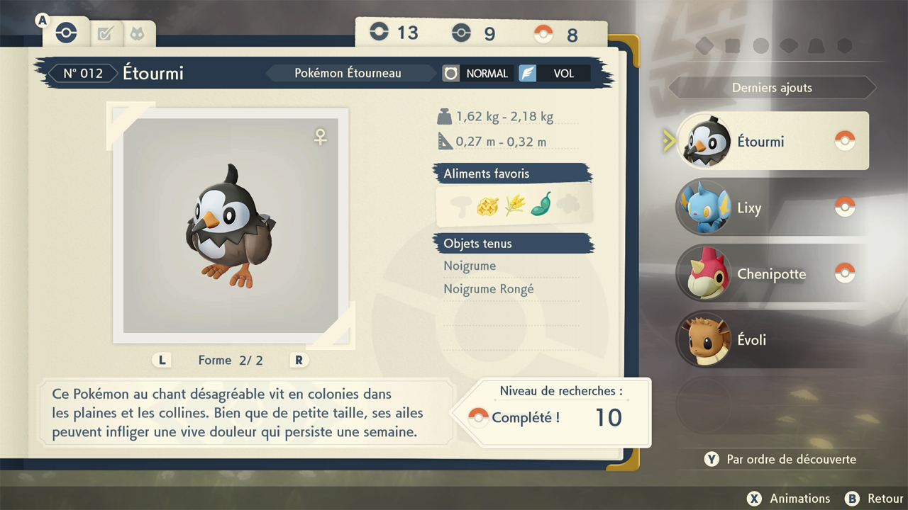
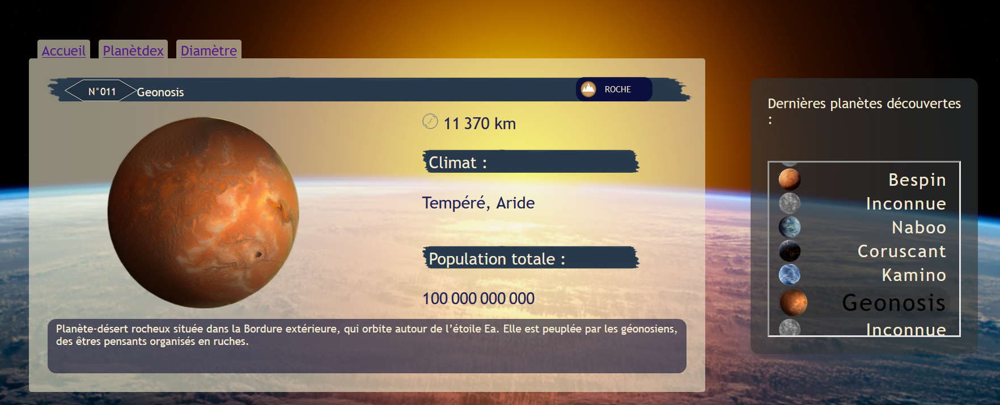
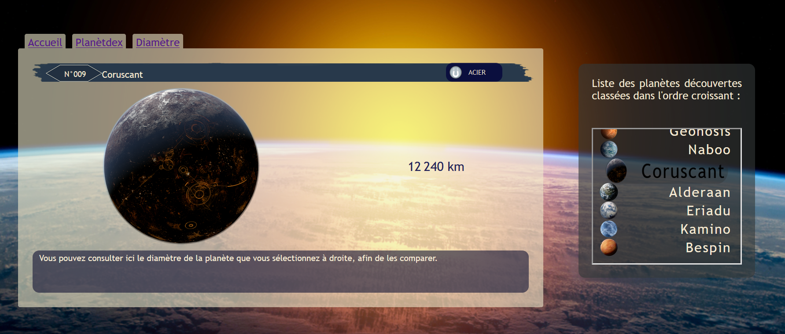
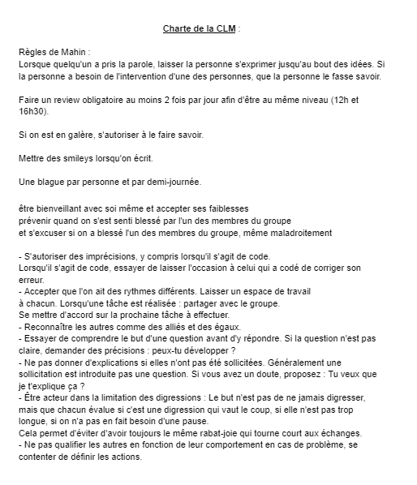

# Projet collectif Dataviz  

## Objectif du projet :  

Développer une application web permettant de visualiser des données de façon dynamique.  

## Conditions :  

`* Langages utilisés : HTML - CSS - Javascript - JSON - Md`
`* Durée du projet : 2 semaines`

## Objectifs pédagogiques :  

`* Travailler notre organisation d'équipe  `
`* Partager les tâches entre nous 3  `
`* Découvrir et traiter les données en temps réel  `
`* Explorer les possibilités du CSS  `
`* Utiliser Git et Github  `

------------------------------------------------------------------

Rendez-vous sur [APIStarWars]https://swapi.dev/ ! Pour la retrouver  

--------------------------------------------------------------------

## Description :  

L'application se présente comme un tableau de bord que l'on pourrait retrouver dans un jeu vidéo. Celui-ci permet de visualiser les planètes déjà découvertes par l'utilisateur, et d'afficher leurs données en cliquant dessus.

### Organisation du travail :

Nous avons fait le choix de travailler avec un Trello.

#### Première étape : Définir un MVP

Nous avons rencontré des difficultés dès le début du projet car nous ne savions pas quel sujet choisir ni quelle API.
Nous avons consacré notre première journée à la découverte des appels API en JS avec l'utilisation des promesses. 
Nous avons également parcouru des listes d'API, à la recherche d'une idée de projet.
Le deuxième jour, nous avons décidé, sur les conseils de nos encadrants, de travailler sur l'API de la NASA sur le système solaire.
Cependant, un autre groupe de travail avait fait ce choix et nous avons préféré changer d'API et donc de MVP.
Le troisième jour, nous avons compris que nous avions des difficultés à collaborer les uns avec les autres, en raison de mode de communications différents.
Plutôt que d'ignorer ce problème, nous avons décidé d'organiser un point. Chacun a pu bénéficier d'un espace de parole propre pour s'exprimer. Puis nous avons proposé des règles à instaurer pour établir une charte.
Suite à cela, nous avons pu définir notre MVP.
--> Nous sommes partis d'un objectif visuel (le pokedex de Pokémon Arcéus), et nous avons commencé à structurer notre page html en fonction.

A partir du quatrième jour, nous avons vraiment pu commencer à coder.

#### Deuxième étape : La réalisation du MVP

Nous nous sommes divisé les tâches. Laure a commencé à travailler sur le css. De notre côté, Mahinthan et moi avons travailler sur l'appel API, la récupération des données et leur traitement.
J'ai également ajouté un fichier annexe pour ajouter des données qui "manquaient" à l'API. Pour réaliser notre projet, nous avons décidé d'attribuer des types aux planètes de star wars (type plante, terre, eau etc.), c'est pourquoi c'était nécessaire.
Laure a rencontré des difficultés à travailler seule sur le CSS. J'ai donc pris part à ce travail. J'en ai profité pour découvrir l'usage des flex-box. De leur côté, Laure et Mahinthan ont travaillé sur des animations CSS, ils ont ajouté des effets visuels au clic des planètes et également un loader car notre API mettait parfois du temps à répondre.

#### Troisième étape : Aller plus loin

Suite à la réalisation du MVP, il nous restait assez peu de temps. J'ai eu envie de tester un autre modèle d'appel API suite à la découverte d'un site qui permettait de classer les planètes de l'univers star wars en fonction d'une caractèristique, leur diamètre, leur démographie, leur poids etc.
J'ai trouvé ça vraiment très intéressant et avec l'accord de Laure et Mahinthan, j'ai proposé d'ajouter un onglet qui permettrait d'afficher le classement des planètes par rapport au diamètre.
L'appel API permet donc de générer la liste des planètes puis nous faisons apparaitre leur classement dans un menu déroulant.
Si nous avions pu aller plus loin, nous aurions voulu proposer un affichage proportionné de la photo de chacune des planètes.

             

